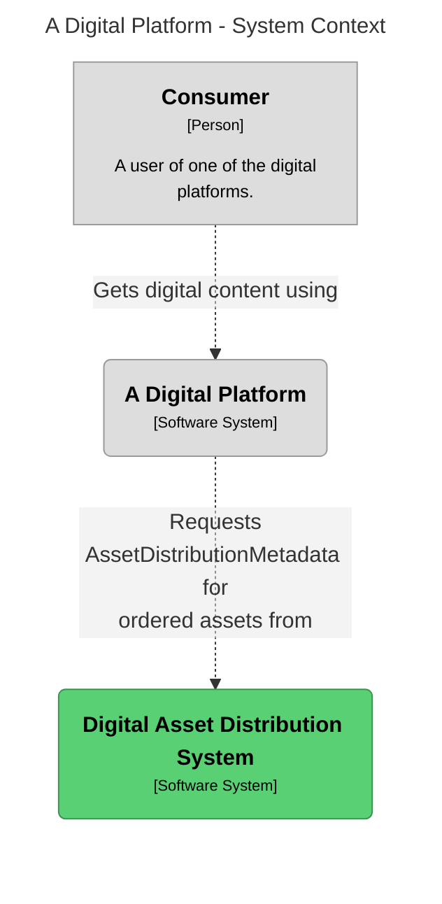
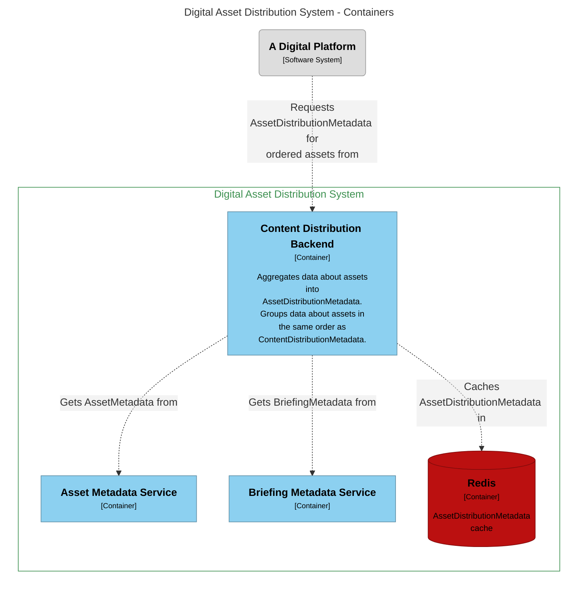
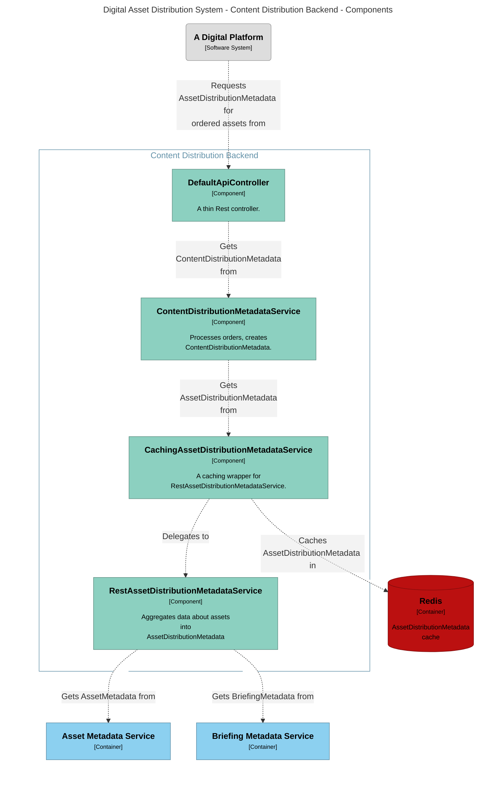

# content-distribution

## Build and run

Linux:
```shell
docker-compose up && docker-compose rm -fsv
```

MacOS:
```shell
docker-compose up || docker-compose rm -fsv
```

Example request:
```shell
curl http://localhost:5000/orderlist --json '{"orderNumber": "ORD123456789","customerName": "John Doe","orderDate": "2023-07-13","totalAssets": 10,"assets": [{"assetId": "ASSET001","quantity": 2},{"assetId": "ASSET002","quantity": 1},{"assetId": "ASSET003","quantity": 3},{"assetId": "ASSET004","quantity": 1},{"assetId": "ASSET005","quantity": 2},{"assetId": "ASSET006","quantity": 1},{"assetId": "ASSET007","quantity": 1},{"assetId": "ASSET008","quantity": 1},{"assetId": "ASSET009","quantity": 1},{"assetId": "ASSET010","quantity": 2}]}'
```

## Software diagrams
Software diagrams are using the C4 model approach.
The architecture was defined using a Structurizr DSL, see file [structurizr.dsl](structurizr.dsl).
Then the views showing the system on different levels were exported as mermaid code and included below.

### System Context Diagram



### Container Diagram



### Component Diagram


